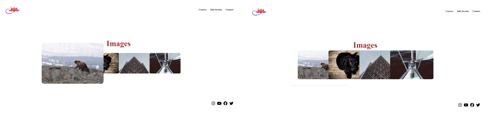

# Transition-Transform-Animation

This project creates a web page using simple CSS transitions and animations. The page contains a title, a set of images, and social media icons. It provides an interactive user experience with CSS animations and transitions.

## Features

- **Title Animation**: The title scrolls from top to bottom as the page loads.
- **Logo Rotation**: The logo rotates 360 degrees when hovered over it.
- **Image Enlargement**: Images enlarge when hovered over them.
- **Social Media Icons**: Social media icons rotate and change color when hovered over.

## Technologies

- HTML
- CSS
- Font Awesome

# Transition-Transform-Animation

Bu proje, basit CSS geçişleri ve animasyonları kullanarak bir web sayfası oluşturur. Sayfa, bir başlık, bir dizi resim ve sosyal medya simgeleri içerir. CSS animasyonları ve geçişleri ile etkileşimli bir kullanıcı deneyimi sağlar.

## Özellikler

- **Başlık Animasyonu**: Başlık, sayfa yüklendiğinde yukarıdan aşağıya doğru kayar.
- **Logo Dönme**: Logo üzerine gelindiğinde 360 derece döner.
- **Resim Büyütme**: Resimler üzerine gelindiğinde büyür.
- **Sosyal Medya İkonları**: Sosyal medya ikonları üzerine gelindiğinde döner ve renk değiştirir.

## Technologies

- HTML
- CSS
- Font Awesome

[Canlı Demo'yu Deneyin](https://fatihycan.github.io/transform-project/)
